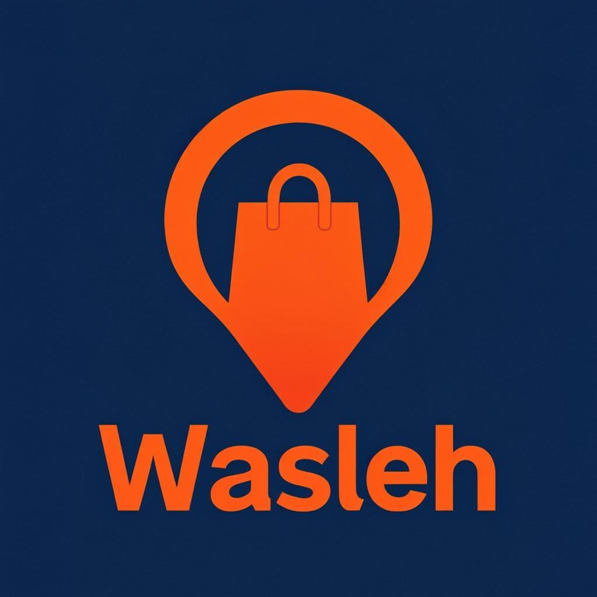

# Wasleh - Full Stack Food Delivery Platform

<div align="center">



**Wasleh (وصلة)** — a complete open-source food delivery platform: customer app, driver app, and restaurant dashboard.

</div>

## Modules

| Module | Tech | Path |
|--------|------|------|
| Customer App | Expo + React Native + Firebase + react-native-maps | [`user-side/`](./user-side) |
| Driver App | Expo + React Native + Firebase + react-native-maps-directions | [`driver-app/`](./driver-app) |
| Restaurant Dashboard | Next.js 13 + Tailwind + Firebase | [`restaurant-dashboard/`](./restaurant-dashboard) |

## Features

### Customer App
- Email/password and Google authentication
- Restaurant search by name and cuisine
- Menu browsing with dish details
- Cart and checkout (credit card / PayPal)
- Real-time order tracking with live driver location
- Order history

### Driver App
- Driver authentication
- Real-time order queue (Firestore onSnapshot)
- Accept / decline orders
- Turn-by-turn navigation (Google Directions API)
- Live driver position broadcast (every 100m)
- Order status flow: READY → ACCEPTED → PICKED_UP → COMPLETE

### Restaurant Dashboard
- Restaurant & admin authentication
- Order management (accept / decline / mark ready)
- Menu management (add / edit / delete dishes)
- Order history
- Settings

## Setup

### 1. Firebase Project

Create a new Firebase project at <https://console.firebase.google.com> and enable:
- **Authentication** (Email/Password + Google provider)
- **Cloud Firestore** (start in test mode first)
- **Storage** (for dish images)

### 2. Google Maps API Key

Create a Google Cloud project and enable:
- **Maps SDK for Android**
- **Maps SDK for iOS**
- **Directions API** (required for driver turn-by-turn navigation)
- **Geocoding API** (optional, for address search)

Restrict the API key to your apps by package name: `com.wasleh.customer` and `com.wasleh.driver`.

### 3. Environment Variables

Copy the `.env.example` files to `.env` and fill in your keys:

```bash
cp user-side/.env.example user-side/.env
cp driver-app/.env.example driver-app/.env
cp restaurant-dashboard/.env.local.example restaurant-dashboard/.env.local
```

### 4. Install Dependencies

```bash
cd user-side && yarn install
cd ../driver-app && yarn install
cd ../restaurant-dashboard && yarn install
```

### 5. Run

**Customer & Driver apps** (Expo):
```bash
cd user-side && yarn start      # or: yarn android
cd driver-app && yarn start
```

**Restaurant dashboard** (Next.js):
```bash
cd restaurant-dashboard && yarn dev    # http://localhost:3000
```

## Android Build

This repo ships with `eas.json` profiles for building APK / AAB.

```bash
# Install EAS CLI globally
npm install -g eas-cli

# Login with your Expo account
eas login

# Build a debug APK for the customer app
cd user-side
eas build --profile preview --platform android

# Build a debug APK for the driver app
cd ../driver-app
eas build --profile preview --platform android
```

For release builds (Play Store), use `--profile production` to produce an AAB.

## Deployment (Coolify / Docker)

A `docker-compose.yml` and `Dockerfile` are included for the **restaurant dashboard**. The mobile apps are shipped via EAS Build / Play Store — they do not run as Docker services.

```bash
# Build & run the dashboard locally with Docker
docker compose up --build -d
```

For Coolify, deploy the `restaurant-dashboard` directory as a Docker Compose project. Set the `NEXT_PUBLIC_*` env vars in Coolify's environment editor.

## Branding

| Token | Value |
|-------|-------|
| Name | Wasleh / وصلة |
| Primary | `#FF6B35` (vibrant orange) |
| Dark | `#1E2A38` (deep navy) |
| Android customer package | `com.wasleh.customer` |
| Android driver package | `com.wasleh.driver` |

## License

This is a derivative of <https://github.com/rush33/food-delivery>. All upstream functionality is preserved.
